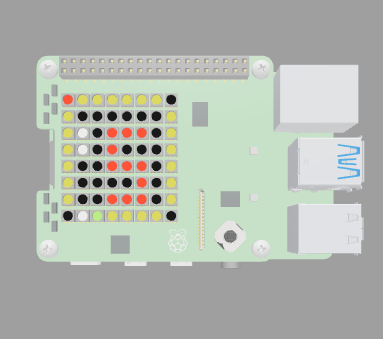
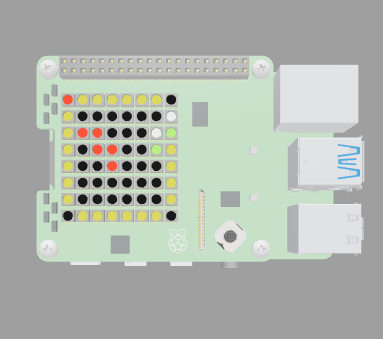

# rpi-sense-hat-clock

  Second Hand Pi Clock (2ndHandPiClock2.py)\
  asun.net 1/4/2025

  Raspberry Pi sense hat 12 hour time of day clock with
  digital or analog hours, analog minutes, and analog seconds.

  The time of day display on the sense hat's 8x8 RGB LED matrix is
  unique for every second around the clock. Any exact hh:mm:ss time
  is visually discernable at any time.

Digital hours time display:\

5:48:35.5

Analog hours time display:\

10:10:10.5

