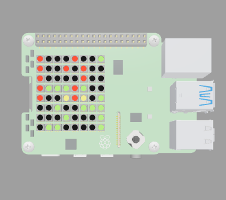

# Raspberry Pi Sense Hat Clocks

This project implements time of day clocks for a
Raspberry Pi equipped with its official Sense Hat.
The clocks utilize the Sense Hat's 8x8 RGB LED matrix
to show the time.

The project's primary design goal is to create
a clock display on a 8x8 color dot matrix with time that is readable
at a glance (one photo frame) without scrolling or flashing text.
Digital clock digits tend to require 3x5 dot matrix fonts to be readable,
and few would fit on a 8x8 display.
Thus, this display size is a major constraint, and presents
difficult clock design challenges.

There are three clock designs presently in this project;
2ndHandPiClock3, DigitalClock3x4, and DigitalClock3x5.
Each clock consists of a single standalone file written in python3.
The clock code runs as is on the Raspberry Pi with Sense Hat hardware
and Raspberry Pi OS or Raspbian operating system software.

The clock code will also run as is on the
Raspberry Pi Sense Hat emulator at
[https://trinket.io/sense-hat](https://trinket.io/sense-hat)

## Second Hand Pi Clock ([2ndHandPiClock3.py](2ndHandPiClock3.py))

This is a 12 hour time of day clock with digital or analog hours,
analog minutes, and analog seconds.
The clock's design shows a unique image for every second around the clock.
Any exact hh:mm:ss time is visually discernable at any time.

Digital hours time display:\

2:45:15

Analog hours time display:\

10:10:40

## Digital Clock 3x4 ([DigitalClock3x4.py](DigitalClock3x4.py))

This is a 24 hour, four digit, digital clock.
A 3x4 dot matrix forms two hours digits and two minutes digits.
Hours and minutes digits have different colors
(red and cyan respectively) to separate them for readablility
since there's no bottom/top pixel spacing between them.
Seconds show as a 6-bit binary pattern of yellow pixels
at the right edge of the display.

18:23:29

## Digital Clock 3x5 ([DigitalClock3x5.py](DigitalClock3x5.py))

This is a 24 hour digital clock with clock digits formed with a 3x5 dot matrix.
Clock digits for hours (red) must overlap with digits for minutes (green)
when there's insufficient space to fit them on the 8x8 display matrix.
The clock changes digit positions by the minute to minimize overlapping digits.
And overlapping pixels use an alternate color pattern
(alternating red/green or yellow) to distinguish the overlapping digits.
There's no seconds display with this clock design.

12:34

