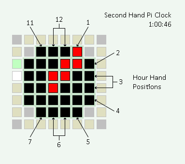

# Raspberry Pi Sense Hat Clocks

This project implements time of day clocks for a
Raspberry Pi equipped with its official Sense Hat.
The clocks utilize the Sense Hat's 8x8 RGB LED matrix
to show the time.


The project's primary design goal is to create
a clock display on a 8x8 color dot matrix with time that is readable
at a glance (one photo frame) without scrolling or flashing text.
Digital clock digits tend to require 3x5 dot matrix fonts to be readable
and too few would fit on a 8x8 display.
Thus, display size is a major constraint and presents challenges
to each of the clock designs.

There are three clock designs in this project:
[2ndHandPiClock3.py](../../raw/refs/heads/main/2ndHandPiClock3.py),
[DigitalClock3x4.py](../../raw/refs/heads/main/DigitalClock3x4.py), and
[DigitalClock3x5.py](../../raw/refs/heads/main/DigitalClock3x5.py).
Second Hand Pi Clock is an analog/digital clock with
minute and second "hands" and is this project's original creation.
The two all digital clocks are based on other similar projects
for Raspberry Pi or Arduino. 

Each clock consists of a single standalone file with code written in python3.
The clock code runs as is on the Raspberry Pi with Sense Hat hardware
and Raspberry Pi OS or Raspbian operating system software.
```
$ uname -a
Linux raspberrypi 6.6.51+rpt-rpi-v7 #1 SMP Raspbian 1:6.6.51-1+rpt3 (2024-10-08) armv7l GNU/Linux
$
$ # download 2ndHandPiClock3.py
$ wget -nv https://github.com/asunxx/rpi-sense-hat-clock/raw/refs/heads/main/2ndHandPiClock3.py
2025-04-21 13:14:33 URL:https://raw.githubusercontent.com/asunxx/rpi-sense-hat-clock/refs/heads/main/2ndHandPiClock3.py [10015/10015] -> "2ndHandPiClock3.py" [1]
$ ls -l 2ndHandPiClock3.py
-rw-r--r-- 1 pi pi 10015 Apr 21 13:14 2ndHandPiClock3.py
$
$ # customize display options (optional)
$ ed 2ndHandPiClock3.py
10015
/set_
#   sense.set_rotation(90)      # Optional
s/#/ /
s/90/180/
.
    sense.set_rotation(180)      # Optional
wq
10016
$
$ # set executable
$ chmod +x 2ndHandPiClock3.py
$ ls -l 2ndHandPiClock3.py
-rwxr-xr-x 1 pi pi 10016 Apr 21 13:16 2ndHandPiClock3.py
$
$ # start the clock in background with no hang up
$ nohup ./2ndHandPiClock3.py &
$ nohup: ignoring input and appending output to 'nohup.out'

$ # stop the clock
$ ps -ef | grep 2ndHandPiClock3
pi        1601  1583  5 13:17 pts/1    00:00:01 python ./2ndHandPiClock3.py
pi        1603  1583  0 13:17 pts/1    00:00:00 grep 2ndHandPiClock3
$ kill 1601
$
```

The clock code will also run as is on the
Raspberry Pi Sense Hat emulator at
[https://trinket.io/sense-hat](https://trinket.io/sense-hat).


## Second Hand Pi Clock ([2ndHandPiClock3.py](2ndHandPiClock3.py))

This is a 12 hour time of day clock with digital or analog hours,
analog minutes, and analog seconds.
The clock's design shows a unique image for every second around the clock.
Any exact hh:mm:ss time is visually discernable at any time.

Clock Dial with Digital Hours\

2:45:15

Clock Dial with Analog Hours\

10:10:40

### Reading the Time of Day

The clock continuously shows the exact time of day
in hours, minutes, and seconds.
When hours appear as digital numbers in red,
reading them is straight forward.
However, the clock can also display an analog hour hand.
Minutes and seconds always appear in analog format,
with format described below.

#### Hours Display - Analog Mode



The clock draws a red line/bar from its center to its yellow border
to simulate an hour hand similar to that of a traditional dial clock.
The hour hand's tip is where it contacts the clock's border.
This tip's position, relative to the clock's face,
denotes the hour in the time of day.
As with a dial clock, when the tip is pointed upward, right, downward, or left,
the respective hour is 12, 3, 6, or 9.

The hour hand will overlap with the minutes display
depending on the time of day.
Regardless, the hour hand's position and hence the time's hour
remain discernable and unambiguous.

#### Minutes Display - Accumulation/Fill Mode


To show minutes, the clock fills the outline of a square ring with white color.
This ring is located just inside the clock's yellow border.
It is empty at 0 minutes at the start of an hour,
fills clockwise from the top center,
and is full at 59 minutes past the hour.
Each of 20 ring positions have a corresponding minute value (see diagram).
The exact value shown applies when the ring to its head is all white.
If a green dot leads a white dot at the ring's head,
then it's one minute past the white position's minute value.
If green trails white instead, it's one minute
prior to the white position's minute value.

The red hours digits may overlap and block parts of the minute ring.
However, the clock will shift digit placement to avoid blocking the ring's head.

#### Seconds Display - Walking Dot Mode


The clock's yellow border is also the active region
for displaying seconds.
When enabled, a white and green clockwise walking dot
pattern appears directly on this square ring and border.
The color pattern and position of the dot(s) along this ring
show seconds for the current time of day.
There are 20 ring positions each with a corresponding seconds value (see diagram).
Note the positions for 00, 15, 30, and 45 are double pixel,
and each position represents 3 seconds.
As with the minute ring display,
when a green dot leads, or trails, a white dot, the
actual seconds is +1, or -1, the white dot position's value
respectively.

### Clock Settings

Second Hand Pi Clock supports multiple and separate settings for
showing seconds, minutes, and hours.
The code variables within 2ndHandPiClock3.py are
`showSecond`, `showMinute`, and `showHour` respectively.
These variables have values hard coded and can only be changed by editing the code.
The comments describe the choices available for each setting.
```python
####
# Clock display settings
####
showSecond = 1  #  0 disable
  #  1 walking dot
  #  2 accumulating seconds ring resetting at 0
  #  3 walking dot starting at top left corner
  # 1x show minutes in place of seconds
showMinute = 2  #  0 disable
  #  1 walking double dot
  #  2 accumulating minutes ring
  #  3 walking single dot starting at top left corner
  # 1x show seconds in place of minutes
showHour   = 1  #  0 disable
  #  1 digital :15 digit placement shift
  #  2 digital :30 digit placement shift
  #  3 analog
  # 1x 24 hour clock
```


## Digital Clock 3x4 ([DigitalClock3x4.py](DigitalClock3x4.py))

This is a 24 hour, four digit, digital clock.
A 3x4 dot matrix forms two hours digits and two minutes digits.
Hours and minutes digits have different colors
(red and cyan respectively) to separate them for readablility
since there's no bottom/top pixel spacing between them.
Seconds show as a 6-bit binary pattern of yellow pixels
at the right edge of the display.


18:23:29


## Digital Clock 3x5 ([DigitalClock3x5.py](DigitalClock3x5.py))

This is a 24 hour digital clock with clock digits formed with a 3x5 dot matrix.
Clock digits for hours (red) must overlap with digits for minutes (green)
when there's insufficient space to fit them on the 8x8 display matrix.
The clock changes digit positions by the minute to minimize overlapping digits.
And overlapping pixels use an alternate color pattern
(alternating red/green or yellow) to distinguish the overlapping digits.
There's no seconds display with this clock design.


12:34

